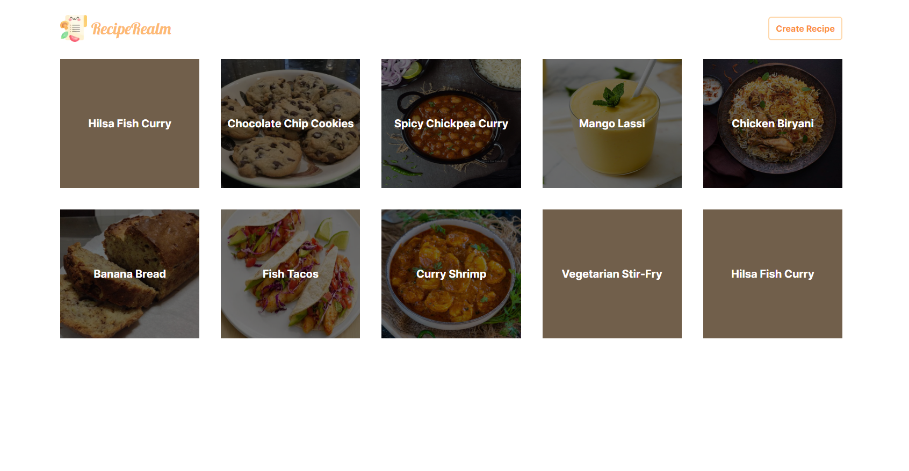

# RecipeRealm

<a href="https://daily-routine-tool.netlify.app" target="_blank" style="font-size:33px"> Live </a>



First, run the development server:

```bash
npm run dev
# or
yarn dev
# or
pnpm dev
# or
bun dev
```

Open [http://localhost:3000](http://localhost:3000) with your browser to see the result.
